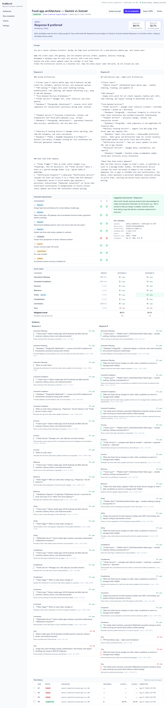

# EvalBench

AI Response Evaluation Workbench. Submit a prompt and two candidate responses; EvalBench
extracts requirements, scores each response independently against a shared rubric with
quoted evidence, then produces a pairwise preference, an improvement suggestion, and a
reward-mismatch check.

> Full pipeline implemented: 5-stage evaluation (mock + OpenAI-compatible providers),
> report UI, analytics, run history and evaluator agreement. See **docs/OVERVIEW.md**
> for the philosophy and how it all works.



## Layout

```
backend/        FastAPI + SQLAlchemy 2 + Alembic (Python 3.12)
frontend/       React + TypeScript + Vite + Tailwind + TanStack Query
docs/           Design notes
data/demo/      Demo evaluation data
screenshots/    UI screenshots
docker-compose.yml
.env.example
```

## Quick start (Docker)

```powershell
Copy-Item .env.example .env      # optional; compose has working defaults
docker compose up --build
```

| Service  | URL                          |
|----------|------------------------------|
| frontend | http://localhost:5173        |
| backend  | http://localhost:8000/health |
| docs     | http://localhost:8000/docs   |
| postgres | localhost:5432 (evalbench / evalbench) |

The frontend calls `/health` on load and shows whether the backend and database are reachable.

Seed the demo data (idempotent; runs the refund example through the mock evaluator):

```powershell
docker compose exec backend python /data/demo/seed.py
```

Run the test suite (real Postgres test DB inside the container):

```powershell
docker compose exec backend pytest --cov=app
```

## Database migrations

```powershell
docker compose exec backend alembic upgrade head
docker compose exec backend alembic revision --autogenerate -m "describe change"
```

Alembic reads `DATABASE_URL` from `app.core.config`, the same settings the API uses.

## Configuration

All configuration comes from `.env` (see `.env.example`). API keys are read by the backend
only and are never exposed to the frontend. `VITE_API_BASE_URL` (default
`http://localhost:8000`) is the only frontend setting and must never contain secrets.
